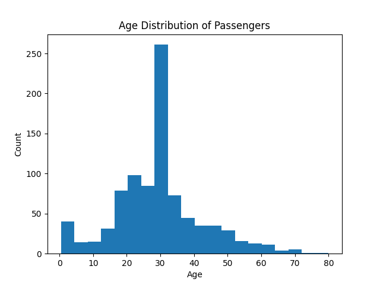
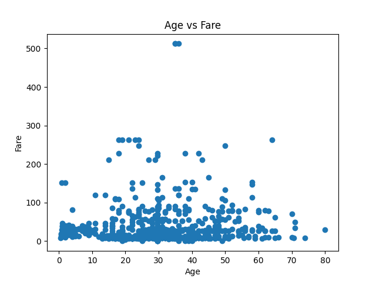
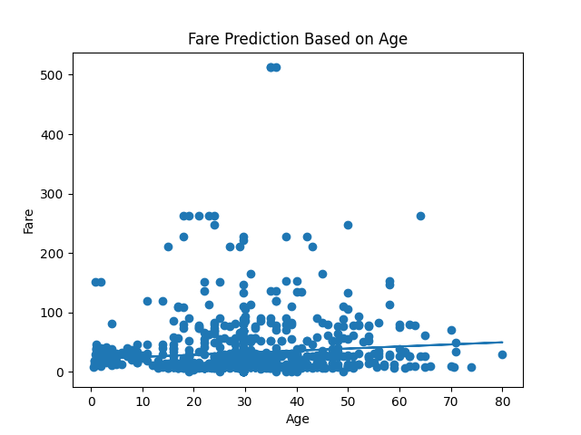

# DataPrediction_GAURAV-N-PATIL
## 📌 Project: Data Analysis & Prediction using Python

### 🧠 Overview
This project performs **data analysis, visualization, and prediction models** using Python libraries such as **NumPy**, **Pandas**, and **Matplotlib**. We use the **Titanic dataset (CSV)** to demonstrate key data science tasks like data cleaning, visualization, and simple linear prediction.

### 📁 Dataset
I use the publicly accessible Titanic dataset (CSV) from GitHub:
📥 `https://raw.githubusercontent.com/datasciencedojo/datasets/master/titanic.csv` :contentReference[oaicite:1]{index=1}

### ✨ Features Implemented

#### ✅ Data Loading
- Loads the Titanic dataset using Pandas.

#### ✅ Data Cleaning & Analysis
- Handles missing values.
- Displays summary statistics (mean, median, etc.).

#### 📊 Visualization
- Generates two visual plots:
  - **Scatter plot**
  - **Histogram**

## 📈 Prediction Explanation

### What is being predicted?
The project predicts **Titanic ticket Fare based on passenger Age**.

### Type of prediction
- Simple **linear regression**
- Numeric value prediction
- Implemented using **NumPy**

### Prediction Logic
The prediction follows a straight-line equation:

Fare = (Slope × Age) + Intercept

This means:
- Passenger **Age** is the input
- **Fare** is the output being predicted
- The model estimates how fare changes as age increases

### Future Predictions
The model predicts fare values for the following ages:
- 20 years
- 30 years
- 40 years
- 50 years

These predicted values are printed in the output and visualized on a graph.

  
 

---

## ⚠️ Important Note
This prediction is **exploratory and educational---for DMX project**.  
It is intended to demonstrate:
- Data handling
- Visualization
- Basic prediction logic

It is **not meant for real-world decision making**.

---

### 📌 How To Run
1. Clone this repo
2. Install dependencies:
  pip install -r requirements.txt
3. Run the main script:
   python main.py

### 📦 Project Structure

DataPrediction_GAURAV-N-PATIL/  
├── main.py   
├── requirements.txt  
├── README.md  
└── outputs/  
├── scatter_plot.png  
└── histogram_plot.png  

### 📌 Scripts & Technology
- **main.py**: Python script for data loading, visualization, and prediction.
- **requirements.txt**: Lists project dependencies.
- **Matplotlib**: For visualizations.
- **NumPy & Pandas**: For numerical analysis and data manipulation.
